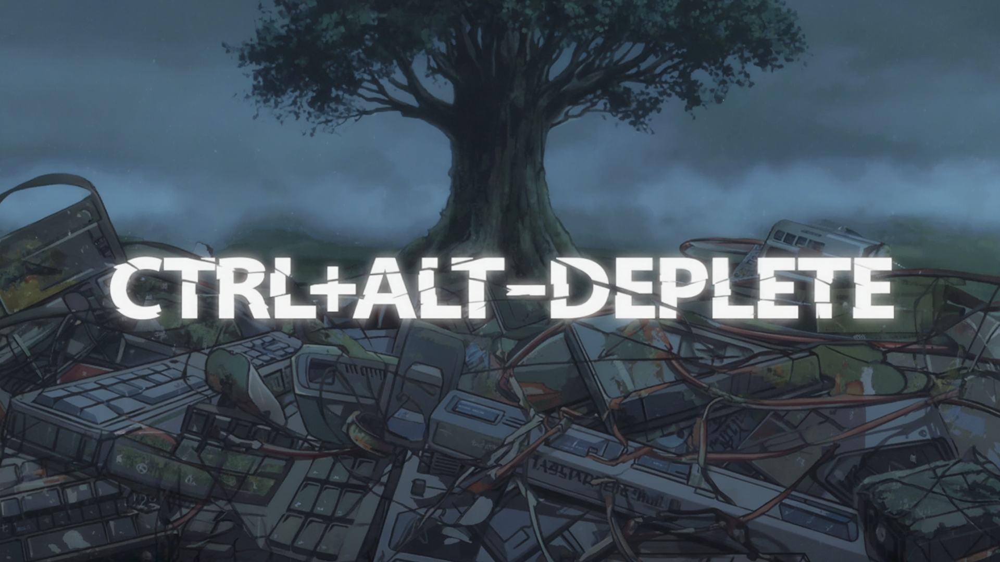

# Ctrl+Alt+Deplete

[Project Video](CtrlAltDeplete.mp4)

Ctrl+Alt+Deplete is a collaborative studio project that explores the intersection of sustainability, sound design, and interactive technology. In an era of material excess, this project reimagines waste as a valuable resource for creating unique sonic experiences. Through the integration of upcycled materials, Arduino, and Processing, we're crafting a mobile sound-producing object that transforms discarded items into an interactive auditory experience.

The project emphasizes the importance of resourcefulness and sonic experimentation, challenging participants to think creatively about material reuse while developing technical skills in digital fabrication and interactive design. Process documentation can be found [here](https://photos.app.goo.gl/EinfqBYZ3w3BtkeDA). 