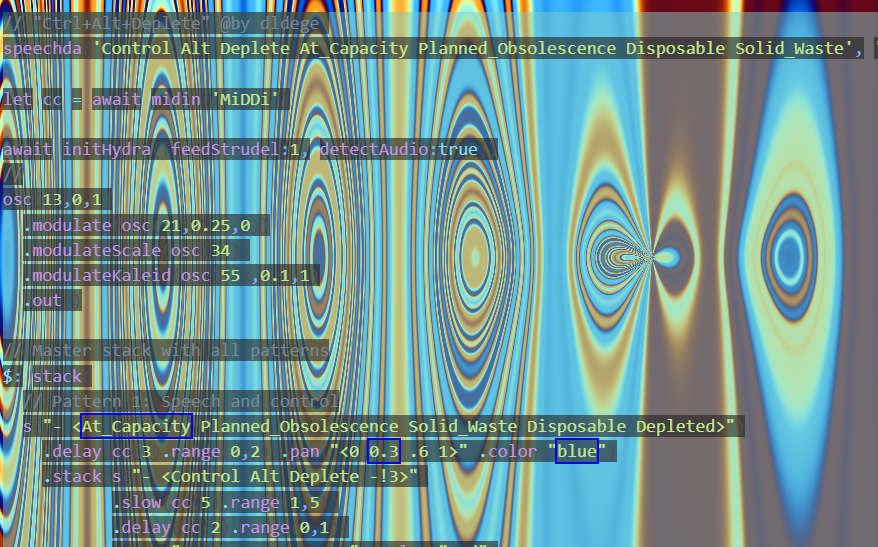
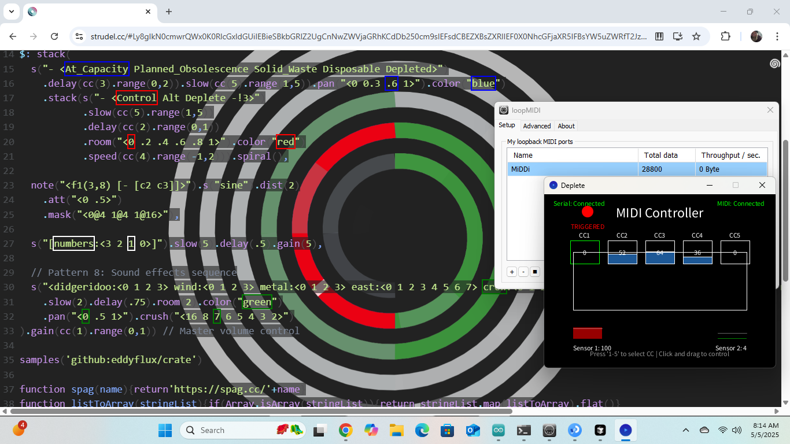

# Ctrl+Alt+Deplete

A MIDI-controlled Strudel project that uses Processing to bridge between physical controls and Strudel's MIDI capabilities.

[@Capacity Installation](AtCapacity/overview.md)





## Setup

### 1. Required Software
- [Processing](https://processing.org/download/)
- [loopMIDI](https://www.tobias-erichsen.de/software/loopmidi.html) (for virtual MIDI routing)
- [Strudel](https://strudel.tidalcycles.org/) (web-based)

### 2. MIDI Setup
1. Install and run loopMIDI
2. Create a new virtual MIDI port named "MiDDi"
3. Keep loopMIDI running in the background

### 3. Processing Setup
1. Open the `Deplete.pde` sketch in Processing
2. Install the following Processing libraries:
   - `processing.serial.*` (built-in)
   - `javax.sound.midi.*` (built-in)
3. Run the sketch

### 4. Strudel Setup
1. Open [Strudel](https://strudel.tidalcycles.org/) in your browser
2. Copy and paste the contents of `CtrlAltDeplete.js` into the editor
3. The code uses Strudel's `midin()` function to receive MIDI Control Change messages:
   ```javascript
   // Example of using MIDI CC values in Strudel
   s("bd").cc(1, 0.5) // CC1 controls the volume of the bass drum
   s("hh").cc(2, 0.8) // CC2 controls the volume of the hi-hat
   ```

## Usage

### MIDI Control
The Processing sketch (`Deplete.pde`) can receive input in two ways:
1. Serial input from a physical device (default port: COM6)
2. Mouse control in the Processing window

#### Mouse Control
- Click and drag vertically in the control area to send MIDI values
- Use number keys 1-5 to change the CC number being controlled
- The vertical position maps to MIDI values (0-127)

#### Serial Control
- Connect your physical device to the specified COM port
- Send values in the range 0-1023 (will be mapped to MIDI 0-127)

### Strudel Control
The Strudel code uses the `cc()` function to map MIDI Control Change messages to various parameters:
- CC1: Controls master volume
- CC2: Controls delay amount
- CC3: Controls delay time
- CC4: Controls speed
- CC5: Controls slow parameter

Example usage in Strudel:
```javascript
// Map MIDI CC1 to control master volume
stack(...).gain(cc(1).range(0,1))

// Map MIDI CC2 to control delay
s("pattern").delay(cc(2).range(0,1))
```

## Troubleshooting

### MIDI Connection Issues
- Ensure loopMIDI is running
- Check that the virtual MIDI port "MiDDi" exists
- Verify the Processing sketch is connected to the correct MIDI port

### Serial Connection Issues
- Check the COM port number in the Processing sketch
- Ensure your physical device is properly connected
- Verify the baud rate matches between the device and sketch

## License
MIT License - Feel free to use and modify for your own projects. 